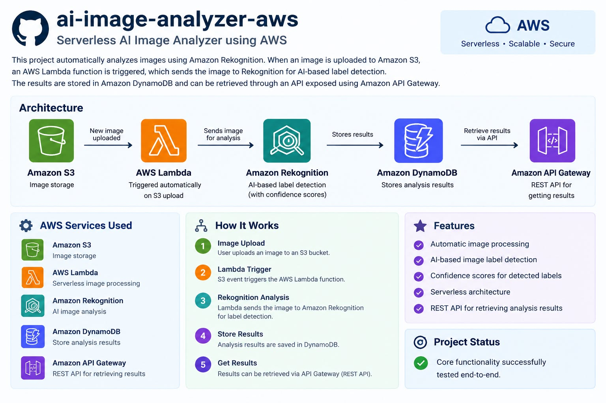

# ai-image-analyzer-aws
serverless AI Image Analyzer using AWS
## Project Overview

AI Image Analyzer is a serverless AWS application that automatically analyzes images using Amazon Rekognition.

When an image is uploaded to Amazon S3, an AWS Lambda function is triggered automatically. Lambda sends the image to Amazon Rekognition for AI-based label detection. The analysis results are then stored in Amazon DynamoDB and can be retrieved through an API exposed using Amazon API Gateway.

## AWS Services Used

- Amazon S3 – Image storage
- AWS Lambda – Serverless image processing
- Amazon Rekognition – AI image analysis
- Amazon DynamoDB – Store analysis results
- Amazon API Gateway – REST API for retrieving results

## Architecture

S3 → Lambda → Rekognition → DynamoDB → API Gateway

## Features

- Automatic image processing
- AI-based image label detection
- Confidence scores for detected labels
- Serverless architecture
- REST API for retrieving analysis results

## Project Status

Core functionality successfully tested end-to-end.
